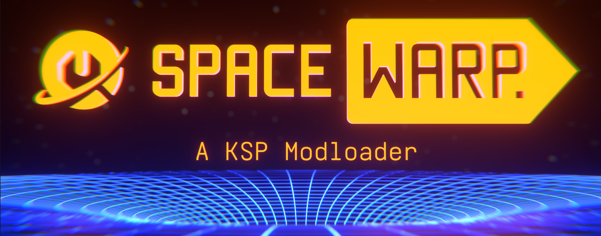

# Space Warp
[](https://www.curseforge.com/kerbal-space-program-2/mods/space-warp)
  


[Documentation](https://wiki.spacewarp.org)

Space Warp is a mod loader for Kerbal Space Program 2.

Note: Use at your own risk, as this is an early version that is expected to undergo many changes.

## Installation

Ensure you have BepInEx correctly installed, it is required for SpaceWarp!

Download the latest release from this page under the [Releases](https://github.com/SpaceWarpDev/SpaceWarp/releases) section above.

Drag the contents of the .zip folder into your KSP2 directory underneath BepInEx as a plugin, commonly located at `C:\Steam\steamapps\common\Kerbal Space Program 2\BepInEx\plugins` or use the [Installer](https://github.com/SpaceWarpDev/Space-Warp-Installer).

In case of installing on Linux under Wine/Proton, you need to override winhttp DLL in winecfg, as described [in BepInEx documentation](https://docs.bepinex.dev/articles/advanced/proton_wine.html).

To install the downloaded mods, simply drag them into the same location: `C:\Steam\steamapps\common\Kerbal Space Program 2\BepInEx\plugins`. Note that with the latest SpaceWarp update, mods are not loaded within the SpaceWarp folder itself.

## Compiling

To compile this project, you will need to follow these steps:

1. Install NuGet
2. Run `nuget restore` inside the top directory to install the packages.
3. Copy everything in the `Kerbal Space Program 2\KSP2_x64_Data\Managed` folder into the `external_dlls/` folder.
4. Run one of the build scripts (see below for more info) and copy the contents from the correct build output directory into the KSP2 root director

Mods are currently implemented as monobehaviours with two fields: a `Logger` for logging and a `Manager` that points to Spacewarp. A mod template generator exists as a Python script.

## Mod Structure

The mod structure is still a work in progress. However, the current structure is as follows:

```
KSP2_Root_Folder/
├── BepInEx/
│   ├── Plugins/
│   │   ├── mod_id_folder_name/
│   │   │   ├── swinfo.json
│   │   │   ├── README.md
│   │   │   ├── assets/
│   │   │   │   ├── bundles/
│   │   │   │   │   ├── *.bundle
│   │   │   │   ├── images/
│   │   │   │   │   ├── *
│   │   │   ├── localizations/
│   │   │   │   ├── *.csv
│   │   │   ├── addressables/
│   │   │   │   ├── catalog.json
│   │   │   │   ├── *
│   │   │   ├── *.dll 
```

## Build Scripts

Each build scripts is essentially just a wrapper around `python3 builder.py $@`. The actual builder code is in `builder.py`.
Before running, open a terminal and `cd` into the repo, then run `pip install -r requirements.txt` to install the required dependencies (its just `argparse`).

The build scripts are:
`build.bat` for Windows, `build.ps1` for Windows (Powershell), and `build.sh` for Linux

The available arguments are:
- `-r` or `--release` to build in release mode

When building, the build output will be in `build/SpaceWarp`, and the compressed version will be `build/SpaceWarp-[Debug|Release]-[commit].zip`.
